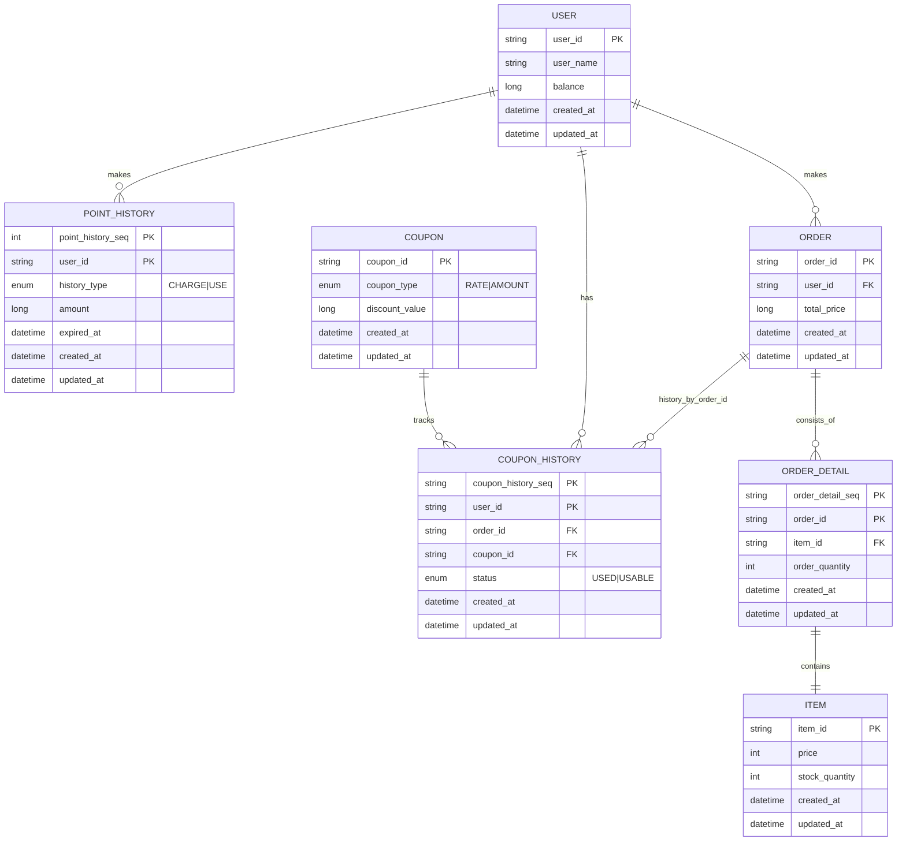

```mermaid
erDiagram
  %% User/Point
  USER {
    string user_id PK
    string user_name
    long balance
    datetime created_at
    datetime updated_at
  }
  POINT_HISTORY {
    int point_history_seq PK
    string user_id PK
    enum history_type "CHARGE|USE"
    long amount
    datetime expired_at
    datetime created_at
    datetime updated_at
  }

  %% Item//Coupon
  ITEM {
    string item_id PK
    int price
    int stock_quantity
    datetime created_at
    datetime updated_at
  }
  COUPON {
    string coupon_id PK
    enum coupon_type "RATE|AMOUNT"
    long discount_value
    datetime created_at
    datetime updated_at
  }
  COUPON_HISTORY {
    string coupon_history_seq PK
    string user_id PK
    string order_id FK
    string coupon_id FK
    enum status "USED|USABLE"
    datetime created_at
    datetime updated_at
  }

  %% Order
  ORDER {
    string order_id PK
    string user_id FK
    long total_price
    datetime created_at
    datetime updated_at
  }
  ORDER_DETAIL {
    string order_detail_seq PK
    string order_id PK
    string item_id FK
    int order_quantity
    datetime created_at
    datetime updated_at
  }

  %% Relationships
  USER ||--o{ ORDER : makes
  USER ||--o{ POINT_HISTORY : makes
  ORDER ||--o{ ORDER_DETAIL : consists_of
  ORDER_DETAIL ||--|| ITEM : contains
  COUPON ||--o{ COUPON_HISTORY : tracks
  USER ||--o{ COUPON_HISTORY : has
  ORDER ||--o{ COUPON_HISTORY : history_by_order_id

```