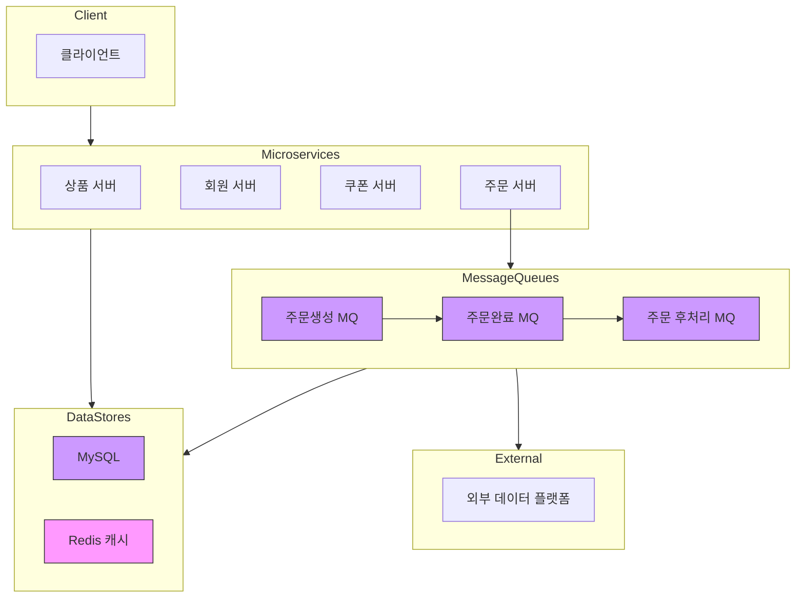

## 아키텍처 개요

```mermaid
graph TD
    %% 그룹 정의
    subgraph Client
        C[클라이언트]
    end

    subgraph Microservices
        PS[상품 서버]
        US[회원 서버]
        CPS[쿠폰 서버]
        OS[주문 서버]
    end

    subgraph DataStores
        M[MySQL]
        RPS[Redis 캐시]
    end

    subgraph MessageQueues
        MQ_C[주문생성 MQ]
        MQ_W[주문완료 MQ]
        MQ_P[주문 후처리 MQ]
    end

    subgraph External
        EDP[외부 데이터 플랫폼]
    end

    %% 연결 관계
    Client --> Microservices
    OS --> MessageQueues

    Microservices --> DataStores
    MessageQueues --> DataStores

    MessageQueues --> External

    MQ_C --> MQ_W --> MQ_P

    %% 상호작용 기능 설명
    style RPS fill:#f9f,stroke:#333
    style MQ_C fill:#c9f,stroke:#333
    style MQ_W fill:#c9f,stroke:#333
    style MQ_P fill:#c9f,stroke:#333
    style M fill:#c9f,stroke:#333
```